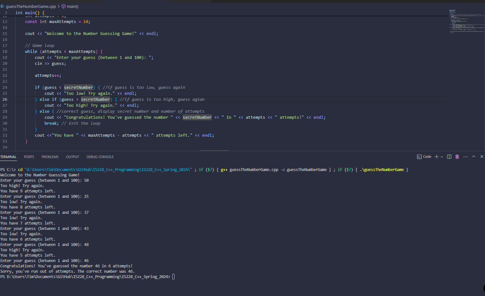
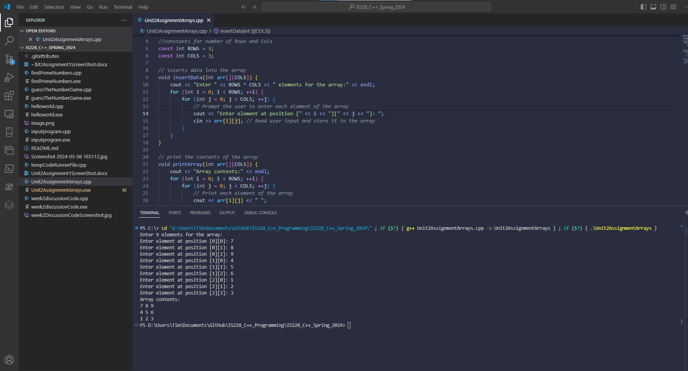
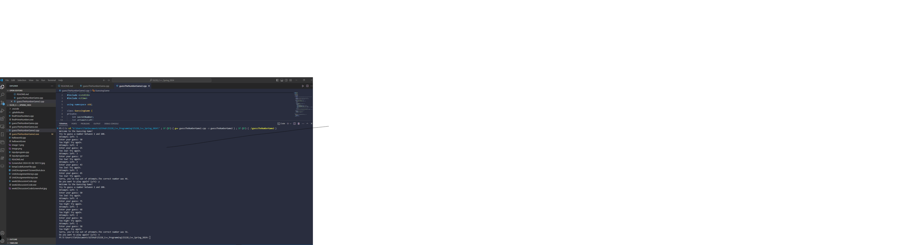
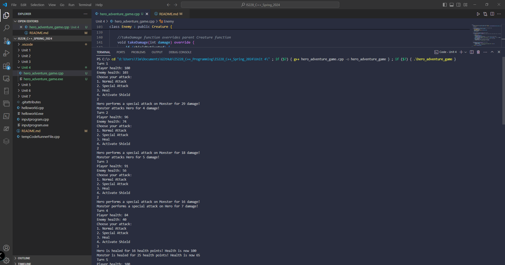
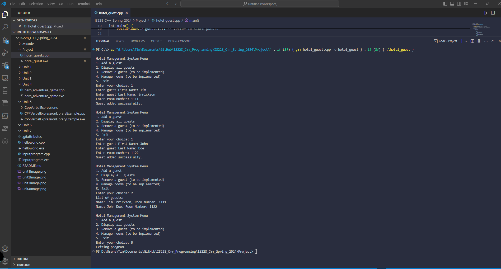

ReadMe file for C ++ IS228
Unit 1 ScreenShot of Guessing game. 
Unit 2 ScrenShot Arrays Assignment
Unit 3 ScreenShot Class,Object, and Functions Assignment 
Unit 4 ScreenShot Adventure Game with Inheritance.
Unit 5 Project 